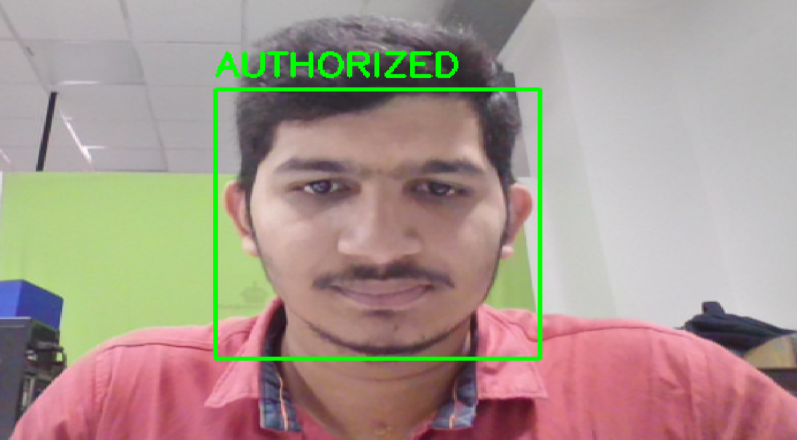
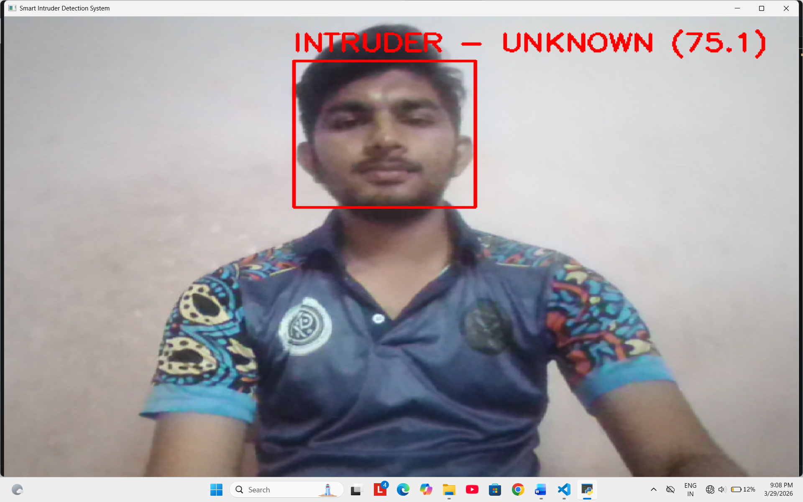
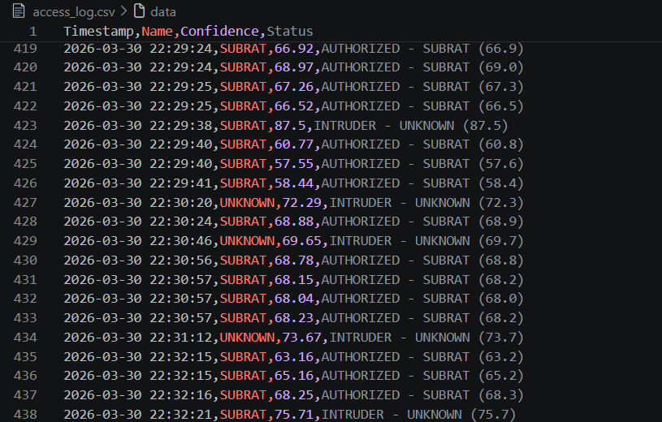
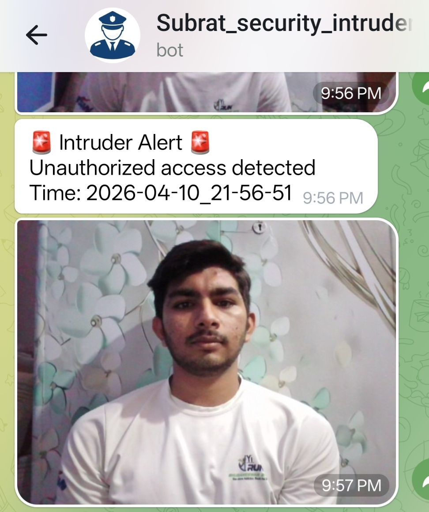

🛡️ AI-Based Smart Intruder Detection System

📌 Overview

This project is a real-time surveillance system built using Python and OpenCV. It detects human faces through a webcam and identifies whether the person is authorized or an intruder using face recognition.

If an intruder is detected, the system:

•	Captures the image 📷 

•	Triggers an alert 🔊 

•	Sends a Telegram notification 📩 

•	Logs the event 📊 

________________________________________

⭐ Key Highlights

•	Real-time face detection and recognition 

•	Intelligent intruder alert system 

•	Telegram integration with image alerts

•	Stable predictions using confidence averaging 

•	Cooldown mechanism to prevent alert spam 

•	Designed for real-world surveillance applications 

________________________________________

🚀 Features

•	Detects faces in real-time using webcam 

•	Recognizes authorized users using LBPH model 

•	Identifies unknown persons as intruders 

•	Captures and stores intruder images 

•	Sends Telegram alerts with captured image 

•	Triggers beep sound for local alert 

•	Maintains CSV log of all events 

•	Confidence averaging for stable detection 

•	Cooldown system to avoid repeated alerts 

________________________________________

🧠 Technologies Used

•	Python 

•	OpenCV (opencv-contrib-python) 

•	NumPy 

•	LBPH Face Recognition 

•	Haar Cascade (Face Detection) 

•	Telegram Bot API 

•	CSV (Logging system) 

________________________________________

🧩 System Architecture

Webcam Input

      ↓
      
Face Detection (Haar Cascade)

      ↓
      
Face Recognition (LBPH)

      ↓
      
Decision Making

   ├── Authorized → No Action
   
   └── Intruder →
   
           ↓
           
     Beep Alert
     
     Capture Image
     
     Send Telegram Alert
     
     Save Log (CSV)
     
________________________________________

🔄 How It Works

1.	Webcam captures live video 
2.	Faces are detected using Haar Cascade 
3.	Face is compared with trained dataset 
4.	System checks confidence score 
5.	If intruder detected: 
o	Beep alert is triggered 
o	Image is saved 
o	Telegram alert is sent 
o	Event is logged in CSV

________________________________________

📷 Output

✅ Authorized User Detection

> System correctly identifies an authorized user.

🚨 Intruder Detection

> Unknown person detected and classified as intruder.

📊 CSV Log Output

> All detection events are recorded with timestamp and status.

📩 Telegram Alert Output

The system sends a real-time alert to the user via Telegram whenever an intruder is detected. The alert includes a warning message, timestamp, and the captured image.

🚨 Alert Example

________________________________________

📂 Data Storage

•	📷 Intruder images → intruder_images/ 

•	📊 Logs → access_log.csv 

________________________________________

📁 Project Structure

intruder_system/

│

├── intr.py

├── trainer.yml

├── labels.pkl

├── access_log.csv

│

├── intruder_images/

│

└── dataset/

    └── SUBRAT/
________________________________________

📦 Requirements

•	Python 3.10

•	Webcam 

•	Internet connection (for Telegram alerts)  

________________________________________

🛠️ Installation

pip install opencv-contrib-python numpy requests

________________________________________

▶️ Run

python intr.py

Press 's' to stop the system.

________________________________________

⚠️ Important Note

Update your Telegram credentials before running:

bot_token = "YOUR_BOT_TOKEN"

chat_id = "YOUR_CHAT_ID"

________________________________________

⚠️ Challenges Faced

•	Reducing false detections 

•	Stabilizing predictions using confidence averaging 

•	Avoiding alert spam using cooldown mechanism 

________________________________________

🔮 Future Improvements

•	Multi-user face recognition 

•	Raspberry Pi deployment 

•	Robot integration 🤖 

•	GUI dashboard 

•	Deep learning-based upgrade (YOLO / CNN)

________________________________________

👨‍💻 Author

Subrat

________________________________________

⭐ About

A real-time AI surveillance system for detecting and alerting intruders using computer vision.

